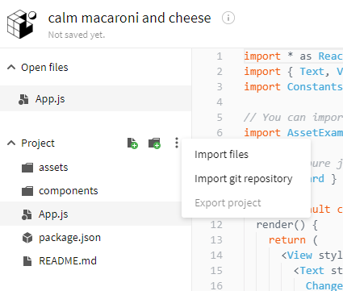
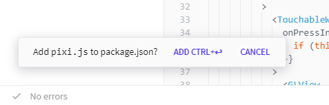

# Create your first React Native mobile app - Haze API App

In this workshop we will be creating a React Native mobile app using Expo. We will use an API \(Application Programming Interface\) as the input/resources/database for the mobile application. The app would consume the JSON resources provided by the API to create a presentable interface where the user can check the daily haze Air Pollution Index in their mobile devices.

## Before you start

* At least some basic understanding of programming is needed, preferably in JavaScript as this is the main language used throughout this course


Doesn't know anything about programming? No worries! Armed with just some common sense and a bit of patience you can go through this workshop as well. If you need any help you can just raise your hand or message me at [@joevo2](https://twitter.com/joevo2)


## Goals 

1. Understand the basic concept of React/React Native
2. Publish the app to a website or at least run it on your phone 

## Overview

* We will be using [Expo Snack](http://snack.expo.io) online editor as the main tools to create this application.
* We will need your iOS or Android phone installed with the[ Expo mobile app](https://expo.io/tools#client), so that the app can tested on your phone.

## Let's start

Let's fire up [Expo Snack](http://snack.expo.io) and clone our first repository by clicking the ... icon and click import git repository.

* Paste this git repository link [`https://github.com/EvanBacon/react-flappy-bird`](https://github.com/EvanBacon/react-flappy-bird) and press the import button.
* Press the add button on the lower left corner as shown below to add the PixiJS library into the project.

* On the right panel you can press Run on your device and scan the QR code with the Expo app on your iOS/Android phone

